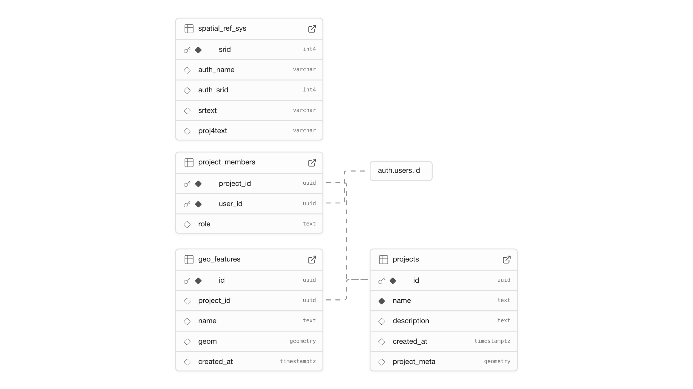

# nur-map

A web application for mapping and visualizing data using Supabase and React.

## To Do:

- [ ] Add github action backup for Supabase database https://supabase.com/docs/guides/deployment/ci/backups

## Features

- 🗺️ Interactive mapping with Leaflet
- ✏️ Draw and edit geometric features (polygons, lines, points)
- 👥 Multi-user project management
- 🔐 Authentication with Supabase Auth
- 📊 GeoJSON data storage and visualization

## Schema Overview



## Tables

| Table                 | Purpose                    | Key Fields                                                                           | Relationships                                  |
| --------------------- | -------------------------- | ------------------------------------------------------------------------------------ | ---------------------------------------------- |
| **`projects`**        | Main project workspace     | `id` (UUID), `name`, `description`, `project_meta` (boundaries/config), `created_at` | Referenced by project_members and geo_features |
| **`project_members`** | User access control        | `project_id` (UUID), `user_id` (UUID), `role` (default: 'editor')                    | Links projects ↔ users                         |
| **`geo_features`**    | Map drawings/shapes        | `id` (UUID), `project_id`, `name`, `geom` (GeoJSON), `created_at`                    | Belongs to a project                           |
| **`spatial_ref_sys`** | PostGIS coordinate systems | `srid`, `auth_name`, `srtext`, `proj4text`                                           | System table for map projections               |

### Key Relationships

- **Users** can be members of multiple **Projects** (many-to-many via project_members)
- Each **Project** can have many **Geographic Features** (one-to-many)
- **Project Members** have roles (currently defaulting to 'editor')
- All geographic data is stored as GeoJSON in the `geom` field

## Getting Started

### Prerequisites

- **Node.js** (v18 or higher recommended)
- **npm** or **yarn**
- **Supabase account** (for cloud setup) or **Supabase CLI** (for local development)

### 1. Install dependencies

```bash
npm install
```

### 2. Set up Supabase

You can use either **Supabase Cloud** (recommended) or **Supabase Local** (for local development).

#### Option A: Using Supabase Cloud

1. Create a project at [supabase.com](https://supabase.com)
2. Get your project URL and anon key from **Settings** → **API**
3. Copy `.env.example` to `.env` and fill in your credentials

**If connecting to an existing database**, you're done - the schema and data are already there.

**If setting up a new database**, continue with:

4. Apply the database schema: Go to **SQL Editor** and run the contents of `supabase/migrations/20251001000000_initial_schema.sql`
5. (Optional) Seed test data:
   - Go to **Authentication** → **Users** → **Add User**
   - Create a user with email `test@gmail.com` and password `password`
   - Copy the new user's UUID from the Dashboard
   - Open `supabase/seed.cloud.sql`, replace `YOUR-USER-UUID-HERE` with the UUID
   - Run the modified SQL in **SQL Editor**

#### Option B: Using Supabase Local

1. Install the Supabase CLI:
   ```bash
   npm install -g supabase
   ```
2. Start local Supabase:
   ```bash
   supabase start
   ```
3. Copy `.env.example` to `.env` and use the local credentials shown in the terminal output
4. Reset database (applies migrations + seed data):
   ```bash
   supabase db reset
   ```
   This creates a test user and project automatically.

### 3. Test user credentials

The seed file (`supabase/seed.sql`) creates a test user you can use immediately (both local and cloud):

| Field    | Value            |
| -------- | ---------------- |
| Email    | `test@gmail.com` |
| Password | `password`       |

This user is automatically added as the owner of a "Test Project".

### 4. Run the development server

```bash
npm run dev
```

The app will be available at [http://localhost:5173](http://localhost:5173) (or the port shown in your terminal).

## Dev Tips

### Code Formatting

This project uses **Prettier** for code formatting and **ESLint** for code quality checks.

### Git Blame Configuration

The `.git-blame-ignore-revs` file is configured to ignore formatting-only commits in git blame. To enable it, run:

```bash
git config blame.ignoreRevsFile .git-blame-ignore-revs
```

When you make a commit that only reformats code (e.g., running `npm run format`), add the commit SHA to `.git-blame-ignore-revs` to keep blame history clean.
